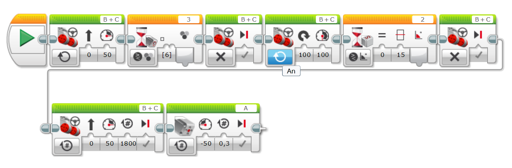

# Tag 7: EV3 Schalter

## Das Spielfeld und die Aufgabe

Gemeinsam haben wir probiert das Männchen in die Basis zu holen.

Aufgabe:

Algorithmus:

- Bis zur weißen Linie fahren
- Eine 15 Grad Drehung
- Geradeausfahren
- ... weiter sind wir nicht gekommen

Die letzte Lösung war die folgende:

