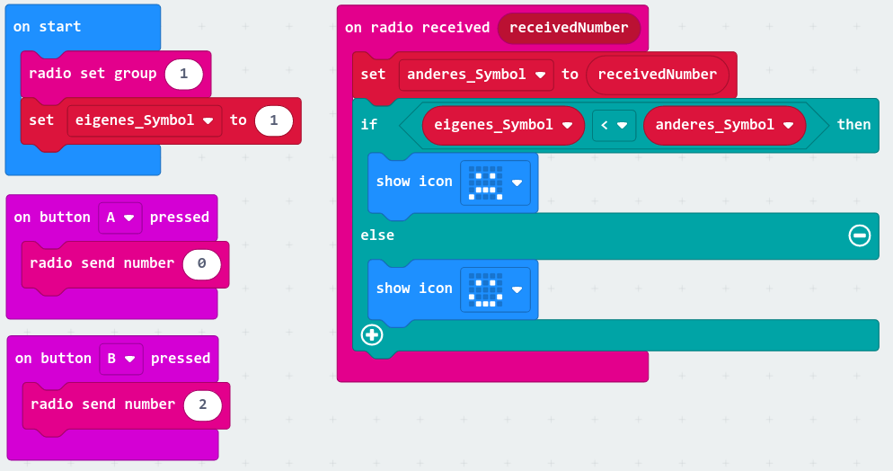

---
substitutions:
  feedback_link: '[Feedback](https://docs.google.com/forms/d/e/1FAIpQLSfHLx_MLUQMPBiE7XlDZGCbwDX_O18NAlnYQ0x4WCZdTQHhaA/viewform?usp=sf_link)'
---
# Tag 15: Peer Learning

**Gratulation zur dritten Kurswoche!** 🎊

Heute steht wieder Peer Learning am Programm.

```{include} ../_peer_learning.md
```


Wir haben verschiedene Themenblöcke vorgesehen:
1. Feedback
2. Berufsbilder und Ausbildungen
  - {ref}`exercise-it-guest-krisztina`
  - {ref}`exercise-it-motivation-3`
  - {ref}`exercise-it-orientation-whatchado`
3. Programmieren mit dem Microbit
  - {ref}`exercise-rock-paper-scissors-diagram`
  - {ref}`exercise-rock-paper-scissors-all-in-one`


## Feedback

% supply link to feedback form in through the preamble's feedback_link variable
{{ ask_for_feedback }}

## Berufsbilder und Ausbildungen

```{exercise} Gastvortragende: Krisztina Horvath-Schwarcz
:label: exercise-it-guest-krisztina

Mit Krisztina als Gast habt ihr die Gelegenheit jemanden kennen zu lernen der
für sich entschieden hat, den Schritt in die IT zu wagen.

Sie befindet seit Sommer in einem Ausbildungskurs von everyone codes und
freut sich euch kennen zu lernen!

Wieso hat sie das gemacht? Wie geht es ihr damit? Was hat sie vor?

Genau dafür ist heute Zeit.

Der Termin findet online statt.

Fragen:
* Was für eine Ausbildung machst du?
* Wie lange dauert die Ausbildung?
* Welche Voraussetzungen gibt es für die Ausbildung?
* Was kannst du nach der Ausbildung machen? Welche Jobaussichten gibt es?
* Wie hast du die Ausbildung gefunden?
* Gibt es eine Aufnahmeprüfung?
* War es für dich die richtige Entscheidung, diese Ausbildung zu beginnen?
* Wie sieht das finanziell aus?
* ...
```

```{exercise} Wie geht es weiter ...?
:label: exercise-it-motivation-3

Ab kommender Woche werden wir uns ausführlicher zu Berufen und Ausbildungen unterhalten.

Solltest du am Ende des Kurse die Frage "IT, ist das was für mich?" mit "Ja!" (oder mit "Ich möchte mir das genauer anschauen")
beantworten, werden wir gemeinsam mit dir einen Karriereplan entwickeln. Idealerweise beantwortet dieser Karriereplan
die folgenden Fragen:
* Welchen Beruf möchtest du ergreifen?
* Welche Ausbildung brauchst du dafür?

Diese Fragen sind natürlich nicht so leicht zu beantworten.

Damit du dir dazu schon einmal Gedanken machen kannst, haben wir auf unserer Kursseite verschiedene
[Angebote zu Themen wie Förderungen, Ausbildungen und Berufsbildern](https://caichinger.gitlab.io/it-ist-das-was-fuer-mich/orientation.html)
gesammelt.

Nimm dir Zeit und schau dir an, was wir dort für euch hinterlegt haben.

Basierend auf dem was du bis jetzt gesehen hast, beantworte folgende Fragen in diesem:
* Gibt es etwas in der IT, das dich anspricht?
* Was hat dir Spaß gemacht?
* Worüber möchtest du mehr erfahren?


Fasse deine Gedanken dazu entweder {{ '[hier]({})'.format(doc_Berufe_und_Kurse) }} zusammen oder, was noch besser wäre,
in einem eigenen Textdokument in dem du {ref}`Markdown <markdown_target>` verwendest.

Wir werden dann kommende Woche deinen Eintrag auf unserer Kursseite mit diesem Inhalt aktualisieren
und auch dein Foto und eine Kurzbeschreibung von dir einfügen.
```

```{exercise} Berufsbilder auf Whatchado (optional)
:label: exercise-it-orientation-whatchado

Was sagst du zu folgenden beiden Berufen?
- [Informations- & Telekommunikationstechnikerin](https://www.whatchado.com/de/stories/esther-binder)
- [IT-Systemkauffrau](https://www.whatchado.com/de/stories/vivien-deutsche-telekom)
```

## Schere-Stein-Papier

Wir haben gestern weitere wichtige Komponenten für unser Programm erarbeitet.

**Anwendung der Regeln**


**Datenaustausch zwischen zwei Microbits mit Radio**


Und unser Programm zum Testen:




```{exercise} Schere-Stein-Papier: Zeichnung für Spielablauf und Programmkomponenten
:label: exercise-rock-paper-scissors-diagram

Wir sind zwar schon öfter gemeinsam vor dem Whiteboard gestanden und
haben die Aufgabe besprochen, hier geht es aber trotzdem noch einmal
darum, eine Zeichnung (Skizze) anzufertigen, die den Spielablauf
und die einzelnen Komponenten (Teile) des Programms beschreibt.

Erstelle also eine neue Zeichnung aus der man ablesen kann:
1. Den zeitlichen (was & wann?) und logischen (was & wie?) Ablauf des Spiels
1. Wichtige Schritte, Konzepte oder Ereignisse im Spiel und die entsprechenden Komponenten im Programm
   (bspw. "Schütteln", "Datenaustausch zwischen Microbits", ...)

Verwende gerne Farben, Pfeile, Nummerierungen, Sprechblasen, Symbole oder andere Hilfsmittel die
es dir erleichtern, die Zusammenhänge zu beschreiben.

Wenn du fertig bist, präsentiere Sashka deine Beschreibung und führe
sie auf dem Papier durch dein Programm.
```

```{exercise} Schere-Stein-Papier: Komponenten zusammen führen
:label: exercise-rock-paper-scissors-all-in-one

Deine Skizze beschreibt, wie welche Komponenten zusammenhängen,
was, wann passiert und welche Daten/Variablen wo gebraucht werden.

Versuche nun, die einzelnen Teile in einem neuen Projekt zusammen zu führen.

Wenn dir noch Komponenten fehlen, beispielsweise diejenigen, die wir gestern
im Kurs besprochen haben, erstelle diese zuerst separat.

Ihr könnte dazu gerne auch im Team arbeiten. Wenn ihr das tut, vergesst nicht:
* Regelmäßig abwechseln und
* aussprechen was ihr tun wollt! 😃

Wir besprechen eure Ergebnisse kommende Woche und werden den Prozess
auch noch einmal gemeinsam durchgehen.

Viel Spaß!

P.S.: Das ist eine recht anspruchsvolle Übung, macht euch keine Sorgen, wenn
es nicht gleich klappt!
```
