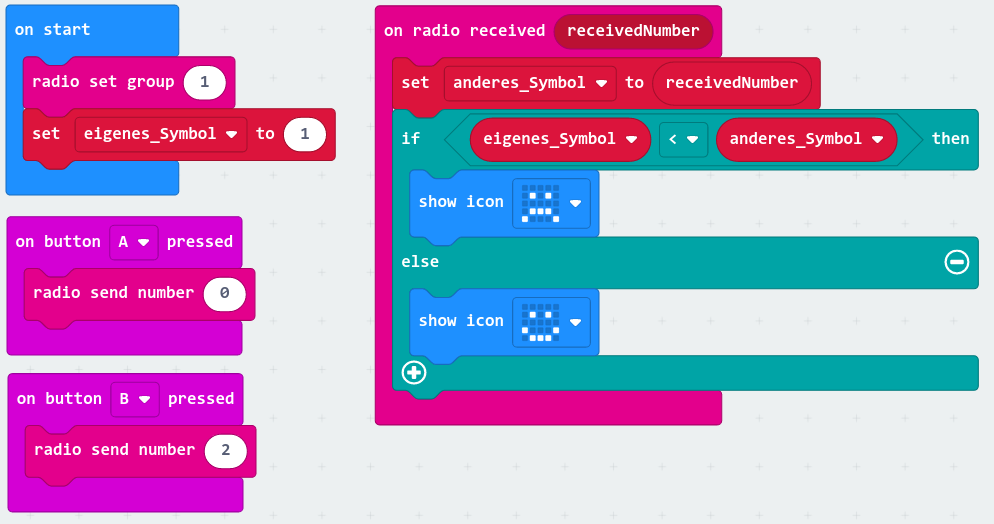

# Tutorial

Der Micro Bit ist ein vielseitig programmierbarer Einplatinencomputer.

Wichtige Links:
- [BBC micro:bit Webseite](https://microbit.org/)
  - [Let's code](https://microbit.org/code/) für Links zu Editoren und dem Classroom
- [Microsoft Make Code für micro:bit](https://makecode.microbit.org/)


## Hardware

Bevor wir mit dem Programmieren loslegen, wollen wir uns die
Hardware genauer anschauen und versuchen, den Micro Bit zu
beschreiben.

Für die nun folgenden Übungen, könnt ihr die Antworten entweder
auf einem Blatt Papier sammeln oder in einem Google Doc eintragen.


```{exercise} Micro Bit Kennzahlen
:label: exercise-micro-bit-numbers

Der Micro Bit ist ein Computer.
Wir wissen also, dass es einen Prozessor und irgendeine Form von Speicher geben muss.

Recherchiere und versuche folgende Fragen zu beantworten:
* Welche Rechenleistung hat der Prozessor?
* Wie viel Arbeitsspeicher gibt es?
* Wie groß ist die Speicherkapazität?

Wofür sind diese drei Größen wichtig?
```

% ```{solution} exercise-micro-bit-numbers
% :class: dropdown
%
%
% ```


```{exercise} Micro Bit Schnittstellen, Sensoren, ...
:label: exercise-micro-bit-interface-and-sensors

Der Micro Bit ist mit diversen Schnittstellen, Sensoren und weiteren Fähigkeiten
ausgestattet.

Schaue dir das Gerät genau an und versuche ihn zu beschreiben.

Beantworte dabei auch die folgenden Fragen:
* Welche Schnittstellen gibt es?
* Was für Sensoren gibt es und was kann man mit ihnen messen?
* Welche Möglichkeiten gibt es um mit dem Gerät zu interagieren?
```

% ```{solution} exercise-micro-bit-interface-and-sensors
% :class: dropdown
%
%
% ```

## Software

Wenn der Micro Bit tun soll, was wir wollen, muss Folgendes passieren:
1. Ein Programm schreiben
1. Das Programm kompilieren
1. Das kompilierte Programm auf den Micro Bit kopieren
1. Das kopierte Programm auf dem Micro Bit ausführen


## Let's Code

Es gibt verschiedene Möglichkeiten Programme für den Micro Bit zu schreiben
und wir werden diese auch noch kennen lernen.

Die ersten Schritte gehen wir alle gemeinsam (mit Hilfe des [Micro Bit Classrooms](https://microbit.org/join)).
Danach kann jede für sich eigene Projekte mit [Microsoft Make Code Micro Bit](https://makecode.microbit.org/) anlegen.

### Ein erster Schritt 💗

```{exercise} Flashing Heart
:label: exercise-micro-bit-flashing-heart

Wir wollen den Micro Bit so programmieren, dass die LED-Matrix ein
blinkendes Herz anzeigt.


* Was muss grundsätzlich passieren?
* Wie könnte das Programm aussehen?
```

% ```{solution} exercise-micro-bit-flashing-heart
% :class: dropdown
%
%
% ```

### Weniger Aufwand mit WebUSB

Bis jetzt haben wir das Programm (HEX-Datei) heruntergeladen und auf den Micro Bit
kopiert. Das geht auch etwas einfacher, wir brauchen dafür aber einen anderen Browser.

```{exercise} Chrome & WebUSB Unterstützung
:label: exercise-micro-bit-chrome-webusb

Schritte:
1. Installiere Google Chrome als neuen Browser
1. Verwende Chrome um ein neues Programm via Make Code zu erstellen
1. Im Download-Menü (...) oder im Einstellungsdialog ⚙️ wähle "pair device" und folge den Anweisungen
1. Überspiele das Programm direkt

Wenn du keinen neuen Browser installieren möchtest, kannst du zuerst
auch einen Blick in [hierher](https://caniuse.com/webusb) werfen und probieren,
ob WebUSB mit einem anderen Browser klappt.
```

### Ein zweiter Schritt 📛

```{exercise} Name Tag (Namenskärtchen)
:label: exercise-micro-bit-name-tag

Wir wollen den Micro Bit so programmieren, dass er unseren Vornamen anzeigt.


* Was muss grundsätzlich passieren?
* Wie könnte das Programm aussehen?
```

```{solution} exercise-micro-bit-name-tag
:class: dropdown


```

### Ein erstes Programm: "Die Würfel sind gefallen" 🎲

```{exercise} Dice (Würfel)
:label: exercise-micro-bit-dice

Wir wollen den Micro Bit so programmieren, dass man ihn verwenden kann wie einen Würfel:
Wenn man ihn schüttelt, soll er eine Zahl anzeigen.


* Was muss grundsätzlich passieren?
* Wie könnte das Programm aussehen?
```

```{solution} exercise-micro-bit-dice
:class: dropdown


```

Wir probieren jetzt eine Abwandlung des obigen Programms.
An stelle von Zahlen, könnte man ja auch zufällige Emojis anzeigen, oder?

### Emojis würfeln? 🎲 + 😃 = ❓

Du weißt wie man einen Würfel baut und Symbole anzeigt.
Kannst du das verbinden und an Stelle von Zahlen Emojis würfeln?

```{exercise} Emoji-Dice (Emoji-Würfel)
:label: exercise-micro-bit-emoji-dice

Wenn man den Micro Bit schüttelt, soll jedes Mal ein anderes Emoji angezeigt werden.

* Was muss grundsätzlich passieren?
* Wie könnte das Programm aussehen?
```

```{solution} exercise-micro-bit-emoji-dice
:class: dropdown


```

Wir werden nun die Ideen und Konzepte der vorherigen Übungen weiter aufgreifen und
noch die Möglichkeit von User Input durch Buttons berücksichtigen.


### Retrospektive mit Emojis? 🤔

Wir wollen ein Programm schreiben, über das wir anzeigen können, wie es uns
geht oder wie uns der Tag gefallen hat. Wenn wir etwas gut finden, könnten wir
einen 😃 anzeigen und wenn wir nicht so
überzeugt sind bspw. einen 😐 darstellen.

```{exercise} Emoji-Stimmung
:label: exercise-micro-bit-retrospective

Die Stimmung soll man über die Buttons auswählen können.

Das gewünschte Verhalten siehst du hier:


Aufgaben und beantwortende Fragen:
1. Beschreibt das Verhalten in Worten
1. Gibt es ein kleineres Programm (eine Abwandlung) von
   der ihr schon wisst, wie sie funktioniert?
1. Aus welchem Komponenten besteht das Programm?
1. Wie hängen diese Komponenten zusammen?

Skizziere das Programm auf Papier oder einem Whiteboard.
Versuche dir zuerst Gedanken zu machen und die obigen Fragen zu beantworten
und erst dann Code zu schreiben.

Bei Fragen oder Unklarheiten einfach melden.
```

```{solution} exercise-micro-bit-retrospective
:class: dropdown


```

```{exercise} Microbit Sensoren entdecken (60 Minuten)
:label: exercise-microbit-sensor-discovery

Entscheide dich für einen der Sensoren, die wir noch nicht verwendet haben.

**Fragen**
- Wofür könnte man diesen Sensor verwenden?
- Wo solche Sensoren zur Anwendung kommen und warum?
- Wie verwendet man ihn beim Microbit?

**Erstelle ein A4 Miniplakat zu diesem Sensor**
- Was macht der Sensor?
- Wofür ist er gut?
- Anwendungsbeispiele

**Programmiere den Microbit**
- Überlege dir eine kleines Programm, das den Sensor verwendet.
  Das Programm soll helfen, den anderen Teilnehmerinnen zu zeigen,
  wofür der Sensor gut ist und wie man ihn verwendet.
- Programmiere den Microbit.

**Präsentation**
- Präsentiere dein Miniplakat und zeige, was dein Microbit macht.
- Beantworte Fragen der anderen Teilnehmerinnen

Diese Aufgabe bearbeitet jede für sich.
```


### Schere, Stein, Papier ✂️ + 🪨 + 📑 = ❓

Kennst du das Spiel Schere, Stein, Papier?

Falls nicht, auf Wikipedia gibt es eine Beschreibung in verschiedenen Sprachen:
- [Deutsch](https://de.wikipedia.org/wiki/Schere,_Stein,_Papier)
- [Arabisch](https://ar.wikipedia.org/wiki/%D8%AD%D8%AC%D8%B1-%D9%88%D8%B1%D9%82-%D9%85%D9%82%D8%B5)

Wir wollen versuchen, diese Spiel zu programmieren.

Wir halten uns weiterhin an unser Motto

> Kleine Schritte, Stück für Stück

Einen Teil der Funktionalität die wir brauchen
haben wir sogar in ähnlicher Form schon einmal
programmiert.
Einen Teil kennen wir noch nicht, den machen wir dann gemeinsam.

```{exercise} Schere, Stein, Papier
:label: exercise-rock-paper-scissor-part-1

Bildet Teams.
Falls ihr das Spiel nicht kennt, lest auch den Artikel auf Wikipedia durch.

Aufgaben:
1. Spiel das Spiel ein paar Mal.
   Wisst ihr, man es spielt?
   Gibt es eine Strategie, mit der man öfter gewinnen kann?
1. Schreibt eine kurze Anleitung, wie man das Spiel spielt
   und wann, wer gewinnt.
1. Übersetzt eure Anleitung in ein Programm.

So wie bisher, skizziert die Anleitung und Programm zuerst auf dem Whiteboard.
Wenn ihr Fragen habt, meldet euch.
Wenn es Unklarheiten oder Probleme gibt, meldet euch.
```

```{solution} exercise-rock-paper-scissor-part-1
:class: dropdown

🤷‍♀️
```

```{exercise} Schere-Stein-Papier: Vorbereitung (Open End)
:label: exercise-rock-paper-scissor-prep

Im Laufe der nächsten Kurstage wollen wir Schere-Stein-Papier
mit dem Microbit umsetzen.
Das heißt:
- Wir verbinden zwei Microbits
- Wir schütteln drei Mal
- Jeder Microbit zeigt ein zufälliges Symbol an
- Der eine gewinnt, der andere verliert

Wie können wir diese Aufgabe angehen?

Wir haben verschiedene Strategien besprochen um Probleme zu lösen.
Schau dir unser Plakat "Wie löse ich ein Problem?" an.

Versuche die Aufgabe besser zu verstehen:
- Spiele das Spiel ein paar Mal mit jemandem in der Klasse
- Fertige Skizzen an
- Erstelle Beschreibungen
- Versuche den Ablauf zu zeichnen

Ihr könnt diese Aufgabe alleine oder in Teams bearbeiten.
```

Wir wollen unser Programm nun so erweitern, dass die Micro Bits
der Spieler_innen über Radio 📻 miteinander kommunizieren und das Symbol austauschen.
Dann kann der Microbit anzeigen, ob man gewonnen hat oder nicht.

Dazu schauen wir uns kurz an, wie Radio funktioniert.

```{exercise} Radio
:label: exercise-basic-radio

Wir wollen zwei Micro Bits miteinander verbinden.
Wenn man auf einem Micro Bit einen Button drückt, soll das auf dem
anderen angezeigt werden.

Aufgaben:
1. Welche Blöcke gibt es in der Rubrik "Radio"?
1. Welche Blöcke brauchen wir noch?

Hinweise: Damit klar ist, welche Micro Bits miteinander kommunizieren (und welche nicht),
wählt man eine Gruppe aus. Informationen werden dann innerhalb dieser Gruppe ausgetauscht.
```

```{solution} exercise-basic-radio
:class: dropdown


```

```{exercise} Schere, Stein, Papier
:label: exercise-rock-paper-scissor-part-2

Aufgaben:
1. Besprecht, was der Mikro Bit tun soll, wenn feststeht, dass man
   gewonnen oder verloren hat.
1. Erweitert das Programm so, dass die Symbole zwischen den Micro Bits
   ausgetauscht werden und das Ergebnis mitgeteilt wird.

So wie bisher, skizziert die Anleitung und Programm zuerst auf dem Whiteboard.
Wenn ihr Fragen habt, meldet euch.
Wenn es Unklarheiten oder Probleme gibt, meldet euch.
```

```{solution} exercise-rock-paper-scissor-part-2
:class: dropdown

🤷‍♀️
```


## Schere-Stein-Papier

Wir haben gestern weitere wichtige Komponenten für unser Programm erarbeitet.

**Anwendung der Regeln**


**Datenaustausch zwischen zwei Microbits mit Radio**


Und unser Programm zum Testen:




```{exercise} Schere-Stein-Papier: Zeichnung für Spielablauf und Programmkomponenten
:label: exercise-rock-paper-scissors-diagram

Wir sind zwar schon öfter gemeinsam vor dem Whiteboard gestanden und
haben die Aufgabe besprochen, hier geht es aber trotzdem noch einmal
darum, eine Zeichnung (Skizze) anzufertigen, die den Spielablauf
und die einzelnen Komponenten (Teile) des Programms beschreibt.

Erstelle also eine neue Zeichnung aus der man ablesen kann:
1. Den zeitlichen (was & wann?) und logischen (was & wie?) Ablauf des Spiels
1. Wichtige Schritte, Konzepte oder Ereignisse im Spiel und die entsprechenden Komponenten im Programm
   (bspw. "Schütteln", "Datenaustausch zwischen Microbits", ...)

Verwende gerne Farben, Pfeile, Nummerierungen, Sprechblasen, Symbole oder andere Hilfsmittel die
es dir erleichtern, die Zusammenhänge zu beschreiben.

Wenn du fertig bist, präsentiere Sashka deine Beschreibung und führe
sie auf dem Papier durch dein Programm.
```

```{exercise} Schere-Stein-Papier: Komponenten zusammen führen
:label: exercise-rock-paper-scissors-all-in-one

Deine Skizze beschreibt, wie welche Komponenten zusammenhängen,
was, wann passiert und welche Daten/Variablen wo gebraucht werden.

Versuche nun, die einzelnen Teile in einem neuen Projekt zusammen zu führen.

Wenn dir noch Komponenten fehlen, beispielsweise diejenigen, die wir gestern
im Kurs besprochen haben, erstelle diese zuerst separat.

Ihr könnte dazu gerne auch im Team arbeiten. Wenn ihr das tut, vergesst nicht:
* Regelmäßig abwechseln und
* aussprechen was ihr tun wollt! 😃

Wir besprechen eure Ergebnisse kommende Woche und werden den Prozess
auch noch einmal gemeinsam durchgehen.

Viel Spaß!

P.S.: Das ist eine recht anspruchsvolle Übung, macht euch keine Sorgen, wenn
es nicht gleich klappt!
```


### E-Textile mit dem Micro Bit: 👟 👕 + 💻 + 💡 = ❓

Der Micro Bit hat diverse Schnittstellen.
Über diese Schnittstellen, kann man zusätzliche Geräte anschließen.

Man kann beispielsweise kleine Lampen (LEDs) anschließen und über den
Micro Bit steuern.

Hast du Ideen, was man damit alles machen könnte?

```{exercise} E-Textile Ideensammlung und Konzepte
:label: exercise-micro-bit-e-textile-1

*In dieser Übung wird noch nicht programmiert, das kommt später.*

Ihr habt einen Micro Bit, diverse LEDs und einen elektrisch leitenden Faden.
Damit könnt ihr beispielsweise einen Schuh oder eine Tasche zum Leuchten
bringen.

Diskutiert gemeinsam und arbeitet einen Vorschlag aus:
* Was für Ideen fallen euch ein?
* Welche davon würdet ihr gerne umsetzen?

Beschreibt eure Idee im Detail:
* Wie sieht sie aus?
* Welche Aufgaben übernimmt der Micro Bit?
* Wie könnte das Programm aussehen?

Präsentiert eure Idee der Gruppe.
```
